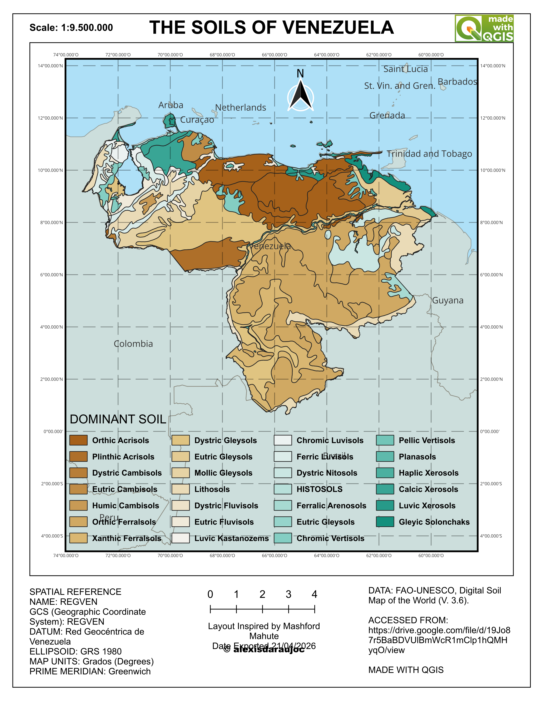

## Technical Project Documentation

### 🎯 The Problem
Agricultural planning, environmental management, and land-use optimization require highly accurate territorial baselines. Raw global geographic data often presents regional inconsistencies, excessive overlapping features, and generic styling that obscures localized insights. This project addresses these limitations by developing a streamlined cartographic framework tailored to the geographical reality of Venezuela. The objective is to isolate, re-project, and categorize complex soil classifications across the country, transforming dense spatial databases into high-contrast, production-ready visual assets that facilitate strategic regional decision-making.

### 📊 The Data
The foundational vector dataset for this analysis was sourced directly from the **FAO Digital Soil Map of the World (DSMW)**. This global repository provides comprehensive, multi-categorical geographic information regarding global soil units and attributes. 

*   **Official Source Portal:** [FAO DSMW Catalog Data](https://data.apps.fao.org/catalog/dataset/446ed430-8383-11db-b9b2-000d939bc5d8)

### ⚙️ Processing Workflow
To convert the raw global data into an institutional-grade layout, the following rigorous spatial engineering pipeline was executed in QGIS:

1.  **Data Ingestion & Filtering:** Loaded the global soil shapefile and applied attribute queries to isolate national and regional geographical limits for Venezuela.
2.  **Coordinate Reference System (CRS) Alignment:** Re-projected the raw dataset from its global coordinate reference frame into the precise local datum for Venezuela (**REGVEN / Venezuela GAS**), ensuring absolute geometric accuracy and preventing distortion during area calculations.
3.  **Spatial Clipping & Boundary Masking:** Applied an administrative mask vector layer to clip the soil dataset, cleanly extracting only the specific boundaries and internal commune divisions of interest.
4.  **Geometry Cleanup:** Executed topology checks to eliminate unnecessary overlapping geometries, edge artifacts, and redundant bounding rectangles, leaving a perfectly framed geographic core.
5.  **Cartographic Styling & Layout Design:** Engineered a custom categorical symbology layout utilizing high-contrast accents and neon-style definition to optimize spatial scannability and professional visual hierarchy.

### 🖼️ Final Output
The final high-resolution map layout demonstrates the successful synthesis of raw spatial data into an operational intelligence tool. 

::: {.column-page}
{fig-align="center" width="100%"}
:::